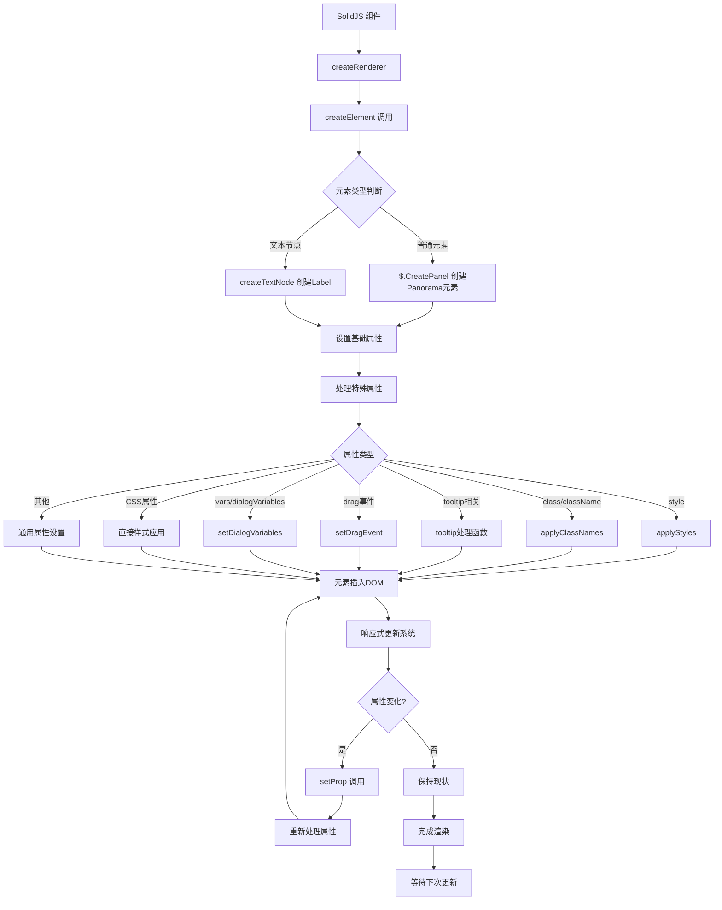
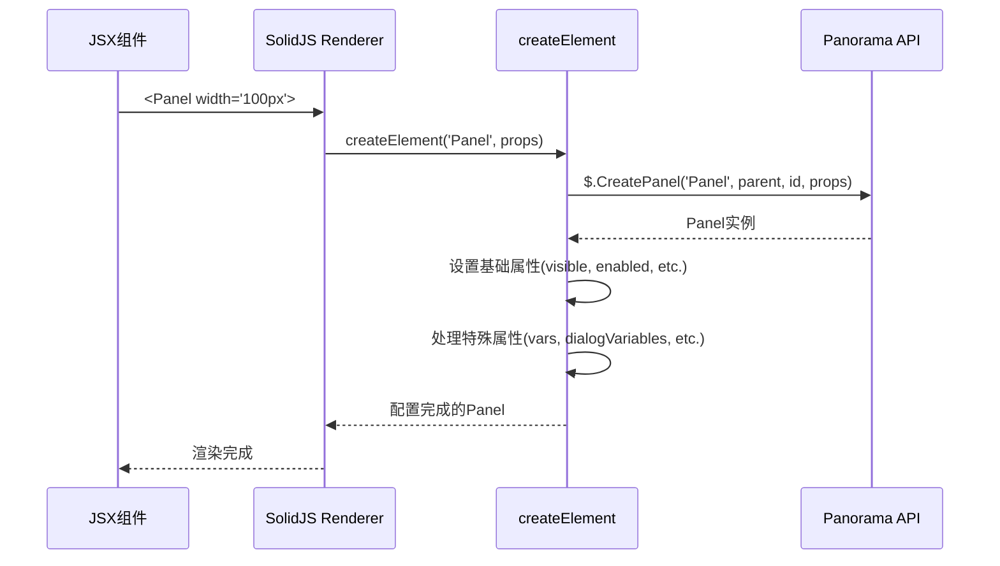
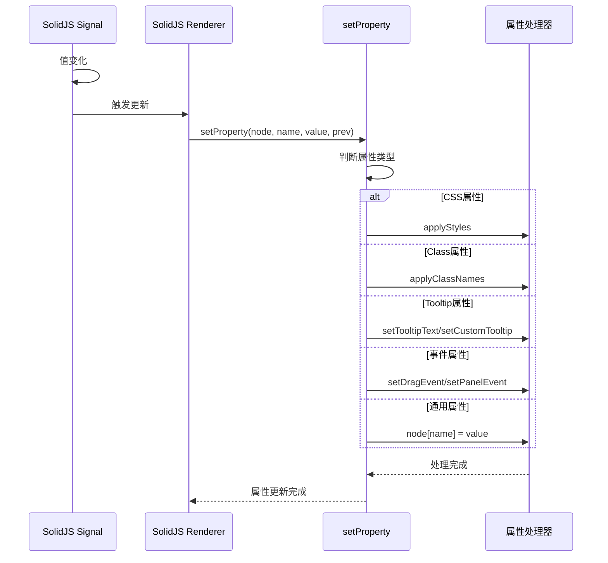

# Solid Panorama Runtime 包分析

## 📋 概述

Solid Panorama Runtime 是一个将 SolidJS 响应式框架适配到 Valve's Panorama UI 系统的核心运行时包。它通过 SolidJS 的 Universal Renderer 机制，创建了一个自定义的渲染器来处理 Panorama API 调用。

## 🏗️ 核心架构

### 主要组件

1. **SolidJS Universal Renderer** - 核心渲染引擎
2. **Panorama DOM 适配器** - 将虚拟DOM操作转换为Panorama API调用
3. **属性处理系统** - 处理各种Panorama特定属性
4. **事件管理系统** - 管理Panorama事件绑定
5. **样式处理系统** - 处理CSS样式应用

## 🔄 运行流程图



## 📦 文件结构分析

### 1. `index.ts` - 核心入口文件

**主要功能：**
- 创建 SolidJS Universal Renderer
- 定义 createElement、createTextNode、insertNode 等DOM操作
- 实现 setProperty 方法处理属性更新
- 导出渲染器API

**关键函数流程：**

```typescript
// 渲染器创建流程
createRenderer<Panel>({
    createElement,      // 创建Panorama元素
    createTextNode,     // 创建文本节点
    insertNode,         // 插入节点
    removeNode,         // 移除节点
    setProperty,        // 设置属性
    // ...其他方法
})
```

### 2. `config.ts` - 配置文件

**功能：**
- 定义自动转换为px单位的CSS属性列表
- 用于样式处理时的数值转换

### 3. `event.ts` - 事件处理

**功能：**
- 处理拖拽事件（DragStart, DragEnd等）
- 自动设置 `SetDraggable(true)` 当绑定DragStart事件时

### 4. `tooltip.ts` - Tooltip管理

**三种Tooltip类型：**
1. **文本Tooltip** - `setTooltipText`
2. **自定义Tooltip** - `setCustomTooltip`
3. **Tooltip参数** - `setCustomTooltipParams`

### 5. 类型定义文件 (`types/`)

- `attributes.d.ts` - Panel属性类型定义
- `elements.d.ts` - Panorama元素类型定义
- `style.d.ts` - 样式类型定义
- `jsx.d.ts` - JSX类型定义

## 🔧 核心处理流程详解

### 1. 元素创建流程



### 2. 属性更新流程



### 3. 样式处理流程

```mermaid
graph LR
    A[CSS属性] --> B{数值类型?}
    B -->|是| C{在自动转换列表?}
    B -->|否| D[直接应用]
    
    C -->|是| E[添加px单位]
    C -->|否| F[保持原值]
    
    E --> G[node.style[key] = value]
    F --> G
    D --> G
    
    G --> H[样式应用完成]
```

## 🎯 核心功能特性

### 1. **响应式属性绑定**
- 支持SolidJS的响应式系统
- 属性变化时自动更新DOM

### 2. **Panorama API 优化**
- 直接传递parent元素减少API调用
- 自动设置 `SetDisableFocusOnMouseDown(true)`

### 3. **智能属性处理**
- CSS属性直接支持（width, height, margin等）
- 自动数值转px转换
- 增强的tooltip系统

### 4. **事件管理**
- 拖拽事件自动化处理
- Panorama事件绑定封装

### 5. **本地化支持**
- 自动识别 `#` 开头的本地化字符串
- 调用 `$.Localize` 处理

## 🔍 关键代码片段分析

### createElement 函数
```typescript
createElement(type: string, props: any, parent?: Panel) {
    // 1. 提取特殊属性
    const { id, snippet, vars, style, visible, enabled, checked, ... } = props;
    
    // 2. 创建Panorama元素
    const el = $.CreatePanel(type, parent || $.GetContextPanel(), id || '', _props);
    
    // 3. 设置基础状态
    if (typeof visible === 'boolean') el.visible = visible;
    if (typeof enabled === 'boolean') el.enabled = enabled;
    
    // 4. 处理特殊功能
    el.SetDisableFocusOnMouseDown(true);  // 防止焦点问题
    if (snippet) el.BLoadLayoutSnippet(snippet);
    if (vars) setDialogVariables(el, vars, {});
    
    return el;
}
```

### setProperty 函数 (部分)
```typescript
setProperty(node: Panel, name, value: any, prev?: any) {
    // 属性类型判断和分发处理
    if (name === 'style') {
        applyStyles(node, value, prev);
    } else if (name === 'width' || name === 'height' || ...) {
        // 直接CSS属性支持
        applyStyles(node, { [name]: value }, prev ? { [name]: prev } : undefined);
    } else if (name === 'tooltip') {
        // 智能tooltip处理
        if (typeof value === 'string') {
            setTooltipText(node, value);
        } else if (value?.name) {
            setCustomTooltip(node, [value.name, value.name]);
        }
    }
    // ...其他属性处理
}
```

## 🎉 总结

Solid Panorama Runtime 通过以下核心机制实现了SolidJS到Panorama的完美适配：

1. **Universal Renderer** - 提供统一的DOM操作抽象
2. **智能属性系统** - 自动识别和处理不同类型的属性
3. **优化的API调用** - 减少不必要的Panorama API调用
4. **响应式更新** - 无缝集成SolidJS的响应式系统
5. **开发体验优化** - 提供类似web开发的体验

这个运行时包是整个solid-panorama生态系统的核心，为开发者提供了一个强大而灵活的Panorama UI开发框架。