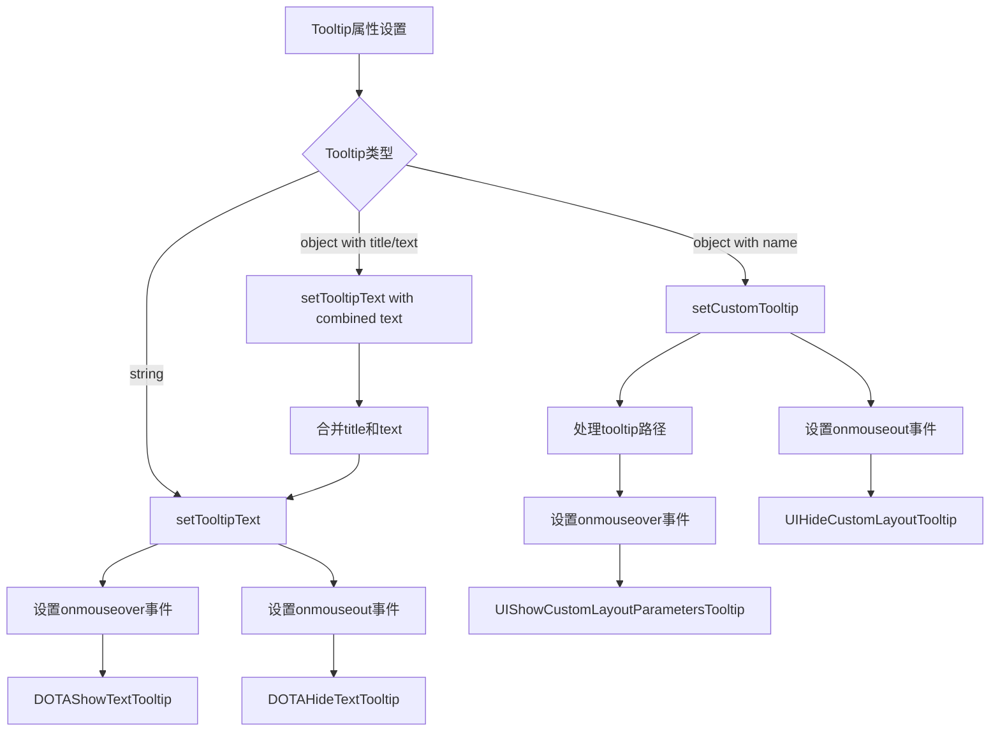
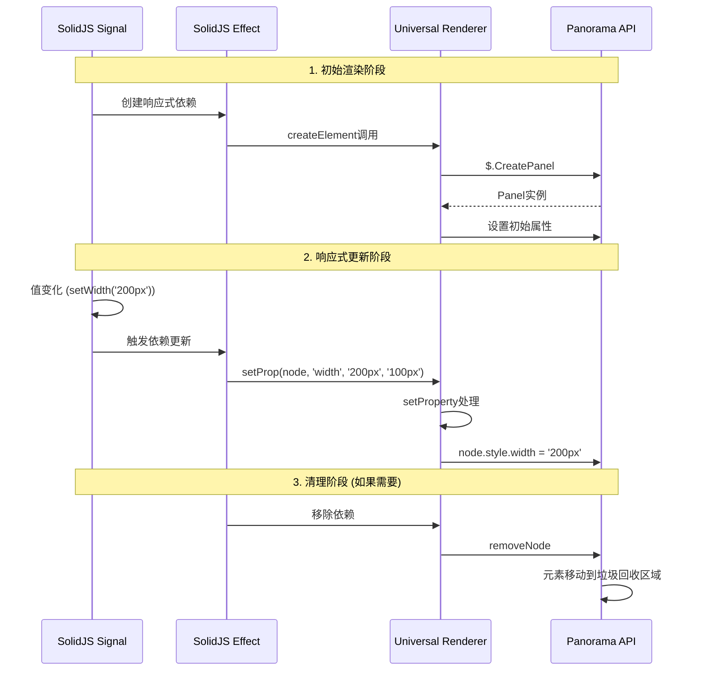

# Solid Panorama Runtime 详细执行流程

## 🚀 启动流程

```mermaid
graph TD
    A[用户代码: render(() => <App />, container)] --> B[_render函数调用]
    B --> C[SolidJS创建响应式上下文]
    C --> D[开始组件渲染]
    D --> E[遇到JSX元素]
    E --> F{元素类型}
    
    F -->|组件| G[createComponent]
    F -->|原生元素| H[createElement]
    F -->|文本| I[createTextNode]
    
    G --> J[组件函数执行]
    J --> K[返回JSX]
    K --> E
    
    H --> L[$.CreatePanel调用]
    I --> M[创建Label元素]
    
    L --> N[属性处理流程]
    M --> N
    
    N --> O[insertNode插入DOM]
    O --> P[完成初始渲染]
```

## 🔄 属性更新流程详解

```mermaid
graph TD
    A[Signal值变化] --> B[SolidJS检测到变化]
    B --> C[触发effect更新]
    C --> D[调用setProp]
    D --> E[setProperty函数]
    
    E --> F{属性名称判断}
    
    F -->|'class'/'className'| G[applyClassNames]
    F -->|'style'| H[applyStyles]
    F -->|'text'| I[设置文本内容]
    F -->|'src'| J[SetImage调用]
    F -->|'classList'| K[updateClassList]
    F -->|'vars'/'dialogVariables'| L[setDialogVariables]
    F -->|'attrs'| M[setAttributes]
    F -->|CSS属性| N[CSS属性处理]
    F -->|'tooltip'| O[Tooltip处理]
    F -->|'on*'事件| P[事件处理]
    F -->|'data-*'| Q[setData]
    F -->|其他| R[通用属性设置]
    
    G --> S[Panel.AddClass/RemoveClass]
    H --> T[Panel.style设置]
    I --> U[Panel.text设置]
    J --> V[Panel.SetImage]
    K --> W[Panel.SetHasClass]
    L --> X[Panel.SetDialogVariable*]
    M --> Y[Panel.SetAttribute*]
    N --> Z[applyStyles调用]
    O --> AA[setTooltipText/setCustomTooltip]
    P --> BB[setPanelEvent/setDragEvent]
    Q --> CC[Panel.Data()设置]
    R --> DD[Panel[name] = value]
    
    S --> EE[DOM更新完成]
    T --> EE
    U --> EE
    V --> EE
    W --> EE
    X --> EE
    Y --> EE
    Z --> EE
    AA --> EE
    BB --> EE
    CC --> EE
    DD --> EE
```

## 🎨 样式处理详细流程

```mermaid
graph TD
    A[applyStyles函数调用] --> B[处理prev样式清理]
    B --> C[遍历新样式对象]
    C --> D{样式值类型}
    
    D -->|number| E{属性在自动转换列表?}
    D -->|string/other| F[直接应用]
    
    E -->|是| G[添加'px'后缀]
    E -->|否| H[保持数值]
    
    G --> I[node.style[key] = value + 'px']
    H --> J[node.style[key] = value]
    F --> J
    
    J --> K{还有更多样式?}
    K -->|是| C
    K -->|否| L[样式应用完成]
```

## 🏷️ Tooltip系统流程



## 🎯 事件处理流程

```mermaid
graph TD
    A[事件属性设置] --> B{事件类型}
    
    B -->|拖拽事件| C[setDragEvent]
    B -->|普通Panel事件| D[setPanelEvent]
    
    C --> E{是DragStart?}
    E -->|是| F[node.SetDraggable(true)]
    E -->|否| G[跳过SetDraggable]
    
    F --> H[$.RegisterEventHandler]
    G --> H
    
    D --> I[node.SetPanelEvent]
    
    H --> J[事件绑定完成]
    I --> J
```

## 🔧 createElement详细流程

```mermaid
graph TD
    A[createElement(type, props, parent)] --> B[解构props]
    B --> C[处理样式字符串]
    C --> D[处理GenericPanel类型]
    D --> E[$.CreatePanel调用]
    
    E --> F[设置基础布尔属性]
    F --> G[visible/enabled/checked]
    G --> H[SetDisableFocusOnMouseDown(true)]
    
    H --> I{是否有style且非字符串?}
    I -->|是| J[applyStyles调用]
    I -->|否| K[跳过样式处理]
    
    J --> L{是否有snippet?}
    K --> L
    L -->|是| M[BLoadLayoutSnippet]
    L -->|否| N[跳过snippet]
    
    M --> O{是否有vars?}
    N --> O
    O -->|是| P[setDialogVariables]
    O -->|否| Q[跳过vars]
    
    P --> R{是否有dialogVariables?}
    Q --> R
    R -->|是| S[setDialogVariables]
    R -->|否| T[跳过dialogVariables]
    
    S --> U{是否有text?}
    T --> U
    U -->|是| V[处理文本内容]
    U -->|否| W[元素创建完成]
    
    V --> X{text以#开头?}
    X -->|是| Y[$.Localize + 设置__solidText]
    X -->|否| Z[直接设置text]
    
    Y --> W
    Z --> W
```

## 📊 响应式更新周期



这个详细的流程分析展示了solid-panorama runtime如何将SolidJS的响应式系统与Panorama UI API完美结合，实现了高效的渲染和更新机制。